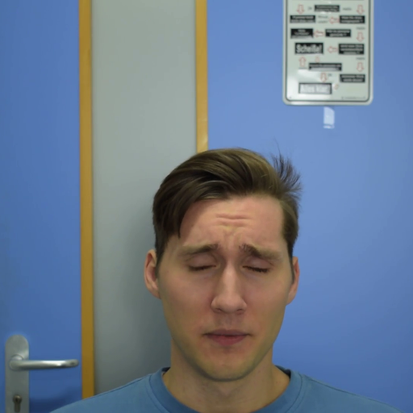
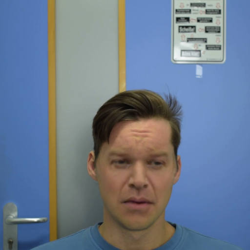
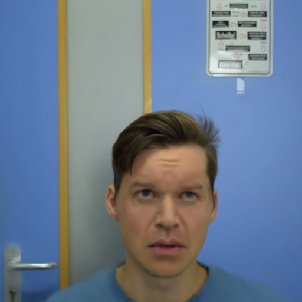
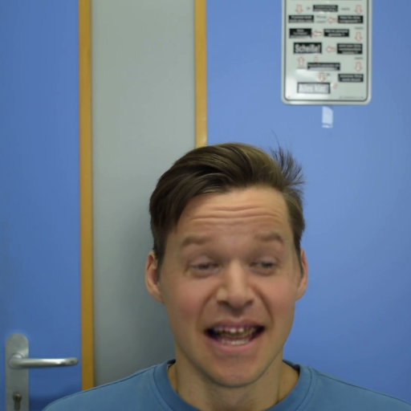
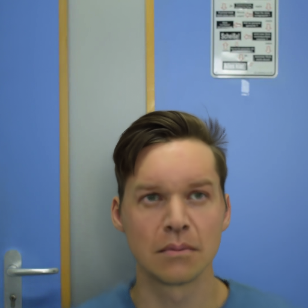
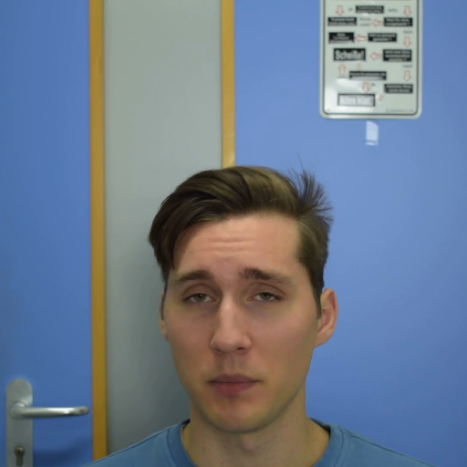
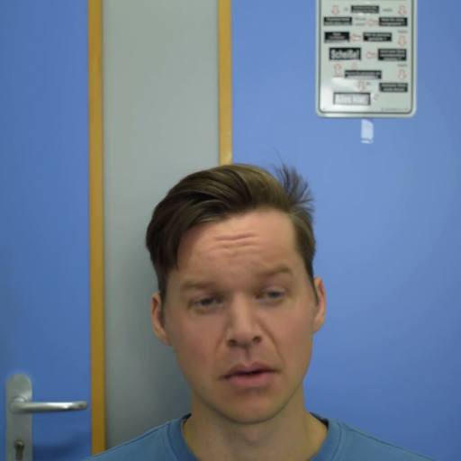
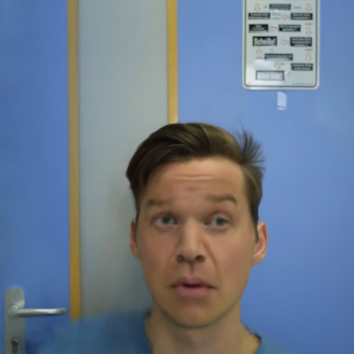
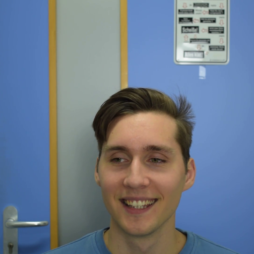
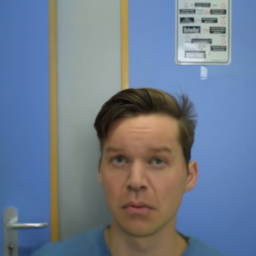

# ImplicitDeepfake

We would like depict steps to reproduce outcomes we achieved and described in paper "ImplicitDeepfake: Plausible Face-Swapping through
Implicit Deepfake Generation using NeRF and Gaussian Splatting". In the aforementioned work we show a novel approach to get 3D deepfake representation of a person using a single 2D photo and a set of images of a base face avatar. Below there is an illustrative movie of such attempt's outcome for Ms. Céline Dion.

Result video: https://drive.google.com/file/d/1QOMExYh2PTGzljTxUWHKpn0JJfTlBclQ/view?usp=drive_link


# Update: 4D ImplicitDeepfake

Now it's possible to use our solution to create 4D deepfake representation. As for 3D version we use single 2D photo and video of a base face avatar. Below we present capabilities of our solution.


Original video: https://drive.google.com/file/d/1almJXLoJ0FJp6amXmAXz-5KbLZH9NLoP/view?usp=sharing

Face to swap with:


Output video: https://drive.google.com/file/d/1n3SnPxv6qKjq9pefCE-UiGzgtK20dHjb/view?usp=drive_link


It's also possible to change facial expressions
| Original              | After ImplicitDeepfake | Changed expression  |
|-----------------|-----------------|-----------------|
|  |  |  |
|  |  |  |
|  |  |  |
|  |  |  |
|  |  |  |

# Citation

We would like to express our gratitude to the authors of Gaussian Splatting and NeRF model, along with the pytorch representation of the latter. We used Gaussian Splatting and NeRF to achieve 3D rendering results.

```
@InProceedings{Gafni_2021_CVPR,
    author    = {Gafni, Guy and Thies, Justus and Zollh{\"o}fer, Michael and Nie{\ss}ner, Matthias},
    title     = {Dynamic Neural Radiance Fields for Monocular 4D Facial Avatar Reconstruction},
    booktitle = {Proceedings of the IEEE/CVF Conference on Computer Vision and Pattern Recognition (CVPR)},
    month     = {June},
    year      = {2021},
    pages     = {8649-8658}
}
```
```
@misc{mildenhall2020nerf,
    title={NeRF: Representing Scenes as Neural Radiance Fields for View Synthesis},
    author={Ben Mildenhall and Pratul P. Srinivasan and Matthew Tancik and Jonathan T. Barron and Ravi Ramamoorthi and Ren Ng},
    year={2020},
    eprint={2003.08934},
    archivePrefix={arXiv},
    primaryClass={cs.CV}
}
```
```
@misc{lin2020nerfpytorch,
  title={NeRF-pytorch},
  author={Yen-Chen, Lin},
  publisher = {GitHub},
  journal = {GitHub repository},
  howpublished={\url{https://github.com/yenchenlin/nerf-pytorch/}},
  year={2020}
}
```
```
@Article{kerbl3Dgaussians,
      author       = {Kerbl, Bernhard and Kopanas, Georgios and Leimk{\"u}hler, Thomas and Drettakis, George},
      title        = {3D Gaussian Splatting for Real-Time Radiance Field Rendering},
      journal      = {ACM Transactions on Graphics},
      number       = {4},
      volume       = {42},
      month        = {July},
      year         = {2023},
      url          = {https://repo-sam.inria.fr/fungraph/3d-gaussian-splatting/}
}
```
Big thanks to the authors of the classical 4D Facial Avatars model. We used it to obtain 4D rendering results.

```
@InProceedings{Gafni_2021_CVPR,
    author    = {Gafni, Guy and Thies, Justus and Zollh{\"o}fer, Michael and Nie{\ss}ner, Matthias},
    title     = {Dynamic Neural Radiance Fields for Monocular 4D Facial Avatar Reconstruction},
    booktitle = {Proceedings of the IEEE/CVF Conference on Computer Vision and Pattern Recognition (CVPR)},
    month     = {June},
    year      = {2021},
    pages     = {8649-8658}
}
```
Big thanks to the authors of the classical 2D deepfake GHOST model.

```
@article{9851423,  
         author={Groshev, Alexander and Maltseva, Anastasia and Chesakov, Daniil and Kuznetsov, Andrey and Dimitrov, Denis},  
         journal={IEEE Access},   
         title={GHOST—A New Face Swap Approach for Image and Video Domains},   
         year={2022},  
         volume={10},  
         number={},  
         pages={83452-83462},  
         doi={10.1109/ACCESS.2022.3196668}
}
```
